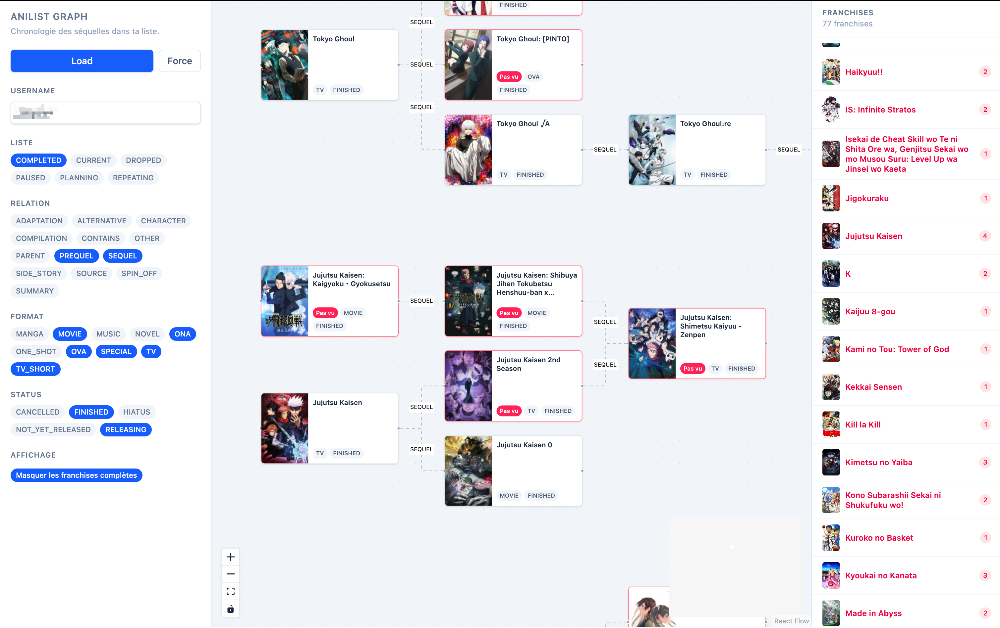

# aniflow

Visualize your AniList library as a **franchise graph**: every anime becomes a
node, prequel / sequel / side-story relations become edges, and each franchise
is laid out chronologically from left to right.

The app talks to the public [AniList GraphQL API](https://graphql.anilist.co)
directly from the browser — no backend, no authentication.

[**Live demo →**](https://tanukijs.github.io/aniflow/)



## Features

- **Load any public list** by AniList username, filterable by list status
  (`COMPLETED`, `CURRENT`, `PLANNING`, …).
- **Automatic relation expansion**: anime that relate to entries in your list
  but aren't in it themselves are fetched in a bounded BFS, so franchises
  look complete even when you've only watched part of them.
- **Filter by relation type, format (TV, Movie, OVA, …) and airing status**.
  Filters drive both the network expansion and the render, so nothing is
  fetched that wouldn't be displayed.
- **Per-franchise layout**: `dagre` computes a horizontal layout for each
  connected component, then franchises are stacked vertically.
- **Gap highlighting**: unwatched anime are outlined in red, and each
  franchise in the right-hand sidebar shows an "unseen" counter.
- **Local cache** (`localStorage`), keyed by username + list status, with a
  *Force* button to refresh.

## Stack

- [React 19](https://react.dev) + [Vite 8](https://vitejs.dev) +
  [TypeScript](https://www.typescriptlang.org)
- [@xyflow/react](https://reactflow.dev) for graph rendering
- [@dagrejs/dagre](https://github.com/dagrejs/dagre) for layout
- [Tailwind CSS v4](https://tailwindcss.com) for styling
- [graphql-request](https://github.com/jasonkuhrt/graphql-request) +
  [GraphQL Code Generator](https://the-guild.dev/graphql/codegen) to type
  the AniList schema

## Getting started

Prerequisites: Node 20 and Yarn 4 (pinned via [Volta](https://volta.sh) — see
the `"volta"` block in `package.json`).

```sh
yarn          # install dependencies
yarn dev      # start the Vite dev server
```

The app opens on `http://localhost:5173`. Enter an AniList username, pick a
list (`Completed` by default), then hit **Load**.

Tip: you can pre-fill the username via the URL: `?username=yourname`.

## Scripts

| Command            | Description                                                |
| ------------------ | ---------------------------------------------------------- |
| `yarn dev`         | Development server with HMR                                |
| `yarn build`       | Type-check + production build (output in `dist/`)          |
| `yarn preview`     | Serve the production build locally                         |
| `yarn type-check`  | `tsc --build --force` only                                 |
| `yarn lint`        | ESLint across the project (strict, type-checked)           |
| `yarn lint:fix`    | ESLint auto-fix                                            |
| `yarn format`      | Prettier write                                             |
| `yarn format:check`| Verify formatting without rewriting                        |
| `yarn generate`    | Regenerate `src/graphql.ts` from the live AniList schema   |

## Project layout

```
src/
├── App.tsx                 # root component: UI state, loading, xyflow render
├── main.tsx                # React entry point
├── graphql.ts              # types generated from the AniList schema (do not edit)
├── types.ts                # domain types (Visibility, Franchise, AnimeFlowNode…)
├── components/
│   ├── AnimeNode.tsx       # xyflow node + reusable CoverImage
│   └── ui.tsx              # UI primitives (Section, ChipGroup, SegmentedGroup)
└── lib/
    ├── anilist.ts          # endpoint + GraphQL queries (collection + page)
    ├── constants.ts        # node dimensions, enum lists, toggle() helper
    ├── expand.ts           # BFS that expands relations beyond the user's list
    ├── build-graph.ts      # orchestrator (collect → franchises → layout)
    └── graph/
        ├── collect.ts      # builds nodes/edges oriented older → newer
        ├── franchises.ts   # connected components, "base" picker, filters
        └── layout.ts       # dagre per franchise, vertical stacking
```

## GraphQL type generation

`src/graphql.ts` is **generated** from the live AniList schema via
`yarn generate` (configured in `codegen.yml`). It is explicitly excluded from
ESLint and Prettier — do not edit it by hand.

## License

[MIT](./LICENSE)
